# Cortex Chat

> **Conversational analytics interface for Snowflake Cortex Analyst.** Ask questions in natural language, get SQL-generated results — rendered as interactive tables and charts, all governed within the Domo platform.


&nbsp;


---


---

## Table of Contents

1. [What Problem Does This Solve?](#what-problem-does-this-solve)
2. [Architecture](#architecture)
3. [Key Capabilities](#key-capabilities)
4. [Code Engine — Backend Functions](#code-engine--backend-functions)
5. [Security Model](#security-model)
6. [Screenshots & UI Tour](#screenshots--ui-tour)
7. [Data Persistence](#data-persistence)
8. [Getting Started](#getting-started)
9. [Available Scripts](#available-scripts)
10. [Project Structure](#project-structure)
11. [Tech Stack](#tech-stack)
12. [License](#license)

---

## What Problem Does This Solve?

Business teams need answers from data — fast. Traditional BI workflows require SQL expertise, dashboard navigation, or waiting for analyst queues. Snowflake's **Cortex Analyst** solves the NL-to-SQL translation problem, but it needs a purpose-built application layer. Domo provides app hosting and governance, but has no native bridge to Cortex Analyst.

**Cortex Chat** closes that gap by combining **three capabilities**:

| Signal | Source | Question It Answers | Status |
|---|---|---|---|
|  | Snowflake Cortex Analyst API | *"What were our top partners by revenue in 2024?"* |  |
|  | Domo Datastores (AppDB) | *"What did I ask last week? Can I rerun that query?"* |  |
|  | AG Grid + Plotly.js | *"Show me this as a chart with time aggregation"* |  |
|  | Redux + Code Engine | *"Now break that down by quarter"* (follow-up) |  |
|  | Domo Datastores | *"Can I point this at a different Snowflake schema?"* |  |

---

## Architecture

```
┌──────────────────────────────────────────────────────────────────────────┐
│                            DOMO PLATFORM                                 │
│                                                                          │
│  ┌─────────────────┐    ┌───────────────────┐    ┌────────────────────┐  │
│  │  Cortex Chat     │    │  Domo AppDB       │    │  Domo Code Engine  │  │
│  │  (React SPA)     │───▶│  (Datastores)     │    │  (Node.js)         │  │
│  │                  │    │                   │    │                    │  │
│  │  • Chat UI       │    │  • configuration  │    │  • OAuth refresh   │  │
│  │  • AG Grid       │    │  • recent_queries │    │  • Cortex Analyst  │  │
│  │  • Plotly.js     │    │                   │    │  • SQL execution   │  │
│  │  • Redux Toolkit │    └───────────────────┘    │                    │  │
│  │                  │                             │                    │  │
│  │                  │─────────────────────────────▶│                    │  │
│  └─────────────────┘                              └─────────┬──────────┘  │
│                                                              │            │
└──────────────────────────────────────────────────────────────┼────────────┘
                                                               │
                                                               ▼
                                                  ┌───────────────────────┐
                                                  │      SNOWFLAKE        │
                                                  │                       │
                                                  │  • Cortex Analyst API │
                                                  │  • Semantic Views     │
                                                  │  • SQL REST API       │
                                                  │  • OAuth 2.0          │
                                                  └───────────────────────┘
```

### Layer Breakdown

| Layer | Technology | Role | Status |
|---|---|---|---|
|  | React, TypeScript, Redux Toolkit | Conversational UI, state, data visualization |  |
|  | AG Grid Community 34 | Sortable, filterable, paginated tables + CSV export |  |
|  | Plotly.js + react-plotly.js | Auto-detected chart types, multi-axis, time aggregation |  |
|  | Domo Code Engine (Node.js) | OAuth token mgmt, Cortex Analyst proxy, SQL execution |  |
|  | Domo Datastores | Config storage, query history (capped at 50) |  |
|  | Domo Accounts → Snowflake OAuth | Refresh token flow; no secrets in code |  |
|  | @domoinc/ryuu-proxy | Local dev → Domo instance API tunneling |  |

---

## Key Capabilities

### 🗣️ Conversational Query Interface

| Feature | Description | Status |
|---|---|---|
| Natural Language Input | Type questions in plain English; Cortex Analyst translates to optimized SQL |  |
| Conversation Memory | Multi-turn history — ask follow-up questions with full context |  |
| Verified Query Suggestions | Pre-built example queries for guided first-run experience |  |
| Processing Animation | Step-by-step overlay: Connect → Analyze → Generate SQL → Execute |  |
| Analyst Interpretation | Shows Cortex Analyst's understanding of the question before results |  |

### 📊 Data Visualization

| View | Technology | Capabilities | Status |
|---|---|---|---|
|  | AG Grid Community | Sorting, column filtering, pagination `10`/`20`/`50`/`100`, cell text selection, CSV export |  |
|  | Plotly.js | Auto chart-type detection (line vs bar), multi-axis, Y-column selection, time aggregation (daily/weekly/monthly/yearly) |  |
|  | React | Question, analyst response, generated SQL, column schema, row count |  |

### 🔄 Query Management

| Feature | Description | Status |
|---|---|---|
| Recent Queries | Persistent history via Domo AppDB — survives page reloads |  |
| One-Click Rerun | Re-execute stored SQL without re-calling Cortex Analyst |  |
| Query Deletion | Delete individual queries with confirmation modal |  |
| Auto-Pruning | Automatically retains only the 50 most recent queries |  |

### ⚙️ Configuration & UX

| Feature | Description | Status |
|---|---|---|
| In-App Config Panel | Set Snowflake database, schema, role, warehouse, semantic view |  |
| Connection Status Bar | Real-time indicator showing active Snowflake configuration |  |
| Dark / Light Theme | Toggle with `localStorage` persistence |  |
| Keyboard Shortcuts | `Enter` to send, `Escape` to close modals |  |
| Error Handling | Retry logic with exponential backoff for transient failures |  |

---

## Code Engine — Backend Functions

The backend runs as a **Domo Code Engine** package — serverless Node.js functions hosted within Domo. Two functions are exposed:

### `callAnalyst`

>  

**Parameters:** `message` · `view` · `database` · `schema` · `role` · `warehouse` · `conversationHistory`

| Step | Action | API |
|---|---|---|
| 1 | Retrieve OAuth credentials from Domo Accounts | `sdk.getAccount()` |
| 2 | Mint fresh Snowflake access token via refresh token | `POST /oauth/token-request` |
| 3 | Build Cortex Analyst request body with conversation history | — |
| 4 | Call Cortex Analyst | `POST /api/v2/cortex/analyst/message` |
| 5 | Extract logical SQL (display) + physical SQL (execution) | — |
| 6 | Execute physical SQL on Snowflake | `POST /api/v2/statements` |
| 7 | Return structured response: columns, rows, analyst metadata, updated history | — |

### `executeStoredSql`

>  

**Parameters:** `sql` · `database` · `schema` · `role` · `warehouse`

Re-executes a previously generated SQL statement against Snowflake without calling Cortex Analyst. Powers the **Rerun Query** feature.

---

## Security Model

| Concern | Approach | Status |
|---|---|---|
|  | OAuth client ID, client secret, and refresh token stored in Domo's encrypted Accounts system — **never in code** |  |
|  | Access tokens minted per-request via refresh token grant; no long-lived tokens cached |  |
|  | Queries execute under the configured Snowflake role, inheriting its permissions |  |
|  | App runs within Domo — inherits SSO, access control, and audit trail |  |
|  | All mock/test data uses synthetic values — no real credentials, schemas, or PII |  |

---

## Screenshots & UI Tour

### Light Mode

<table>
<tr>
<td width="50%">

**Landing Page** — Verified query suggestions, connection status bar, theme toggle


</td>
<td width="50%">

**Configuration Panel** — Connect to any Snowflake database, schema, warehouse, role, and semantic view

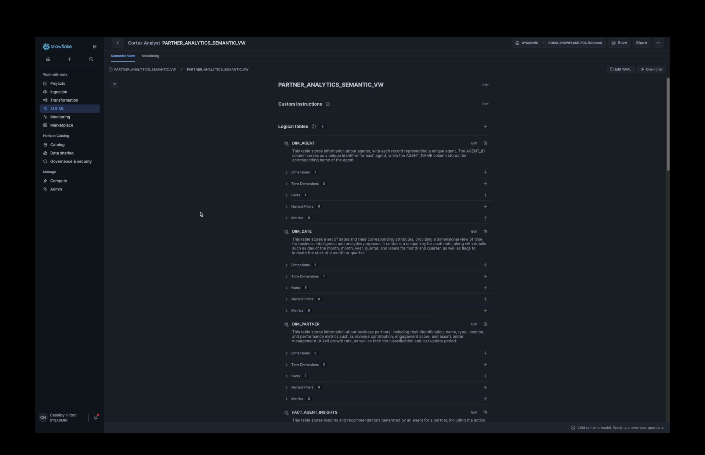

</td>
</tr>
<tr>
<td>

**Ask a Question** — Natural language input with send button and helper text

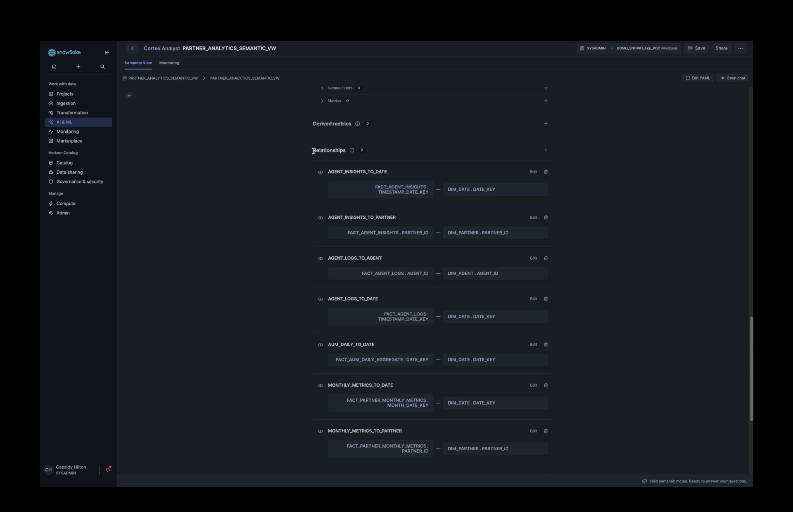

</td>
<td>

**Processing Animation** — Step-by-step: Connect → Analyze → Generate SQL → Execute

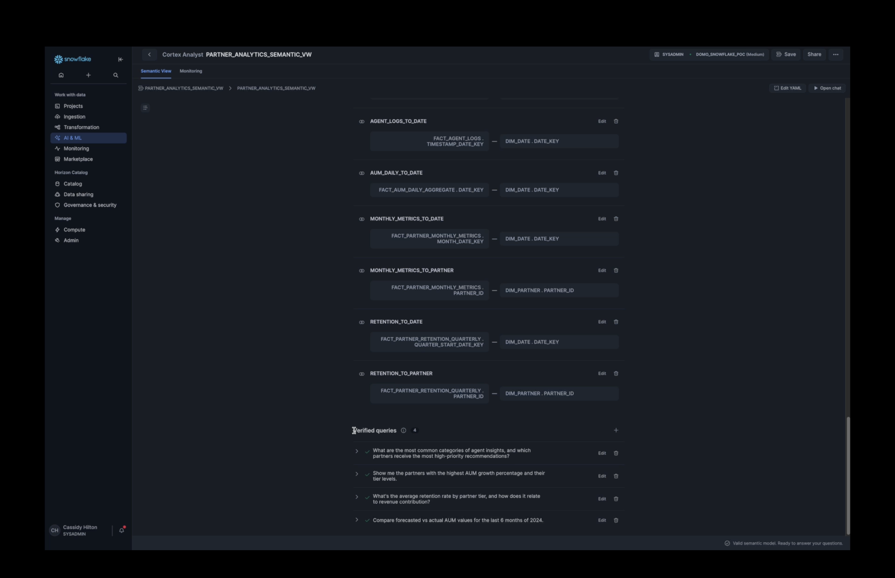

</td>
</tr>
<tr>
<td>

**Analyst Response** — Cortex Analyst interpretation + generated SQL in chat

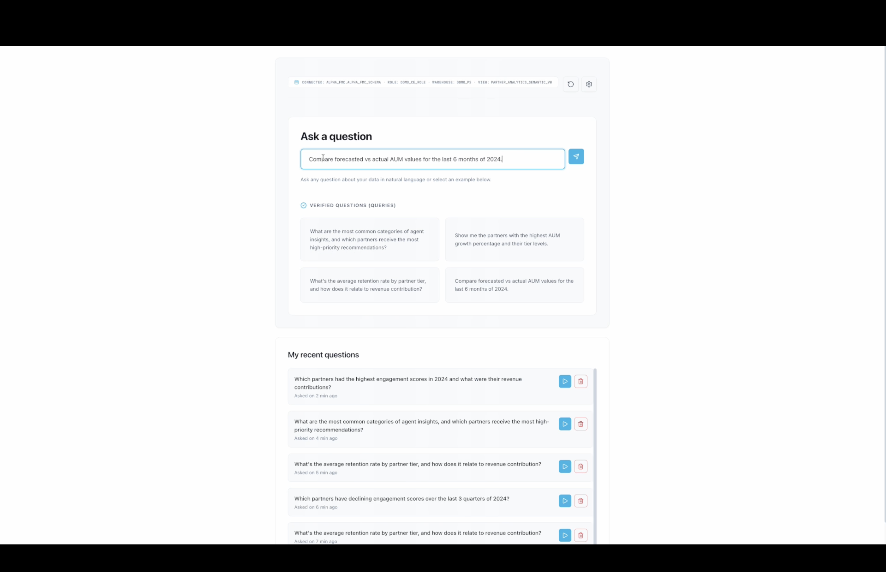

</td>
<td>

**Table Results** — AG Grid: sorting, filtering, pagination, CSV export

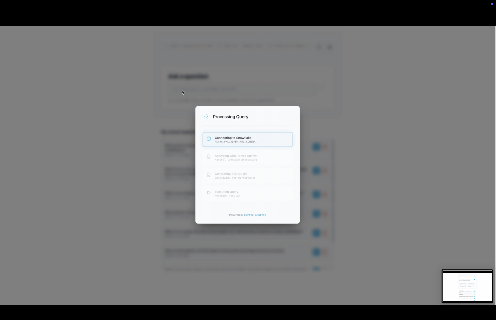

</td>
</tr>
<tr>
<td>

**Chart View** — Plotly.js with auto-detection, Y-axis selection, time aggregation

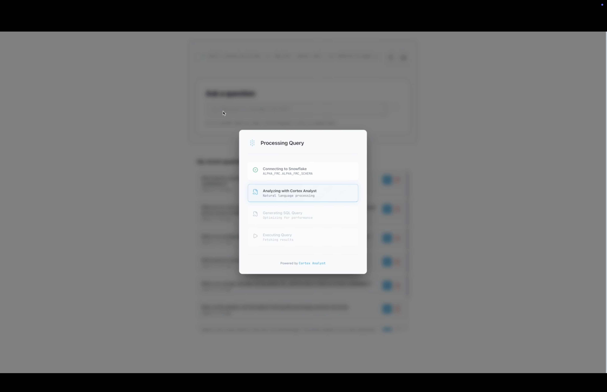

</td>
<td>

**Query Details** — Audit trail: question, analyst response, SQL, results summary

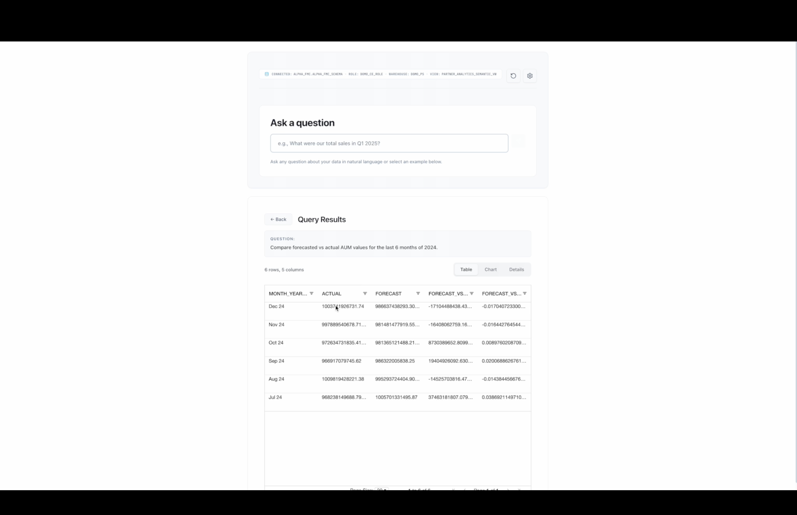

</td>
</tr>
<tr>
<td>

**Recent Queries** — Query history with rerun, delete, and result preview

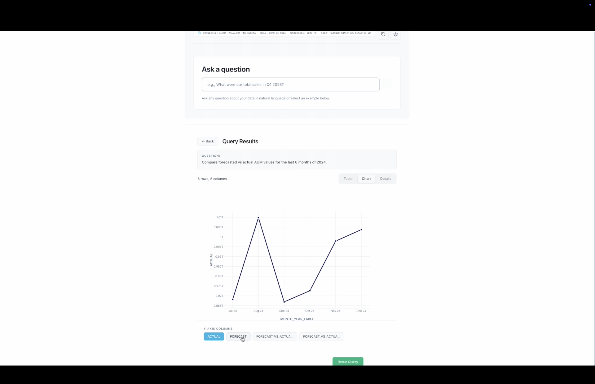

</td>
<td>

**Rerun Query** — Re-execute stored SQL with loading indicator

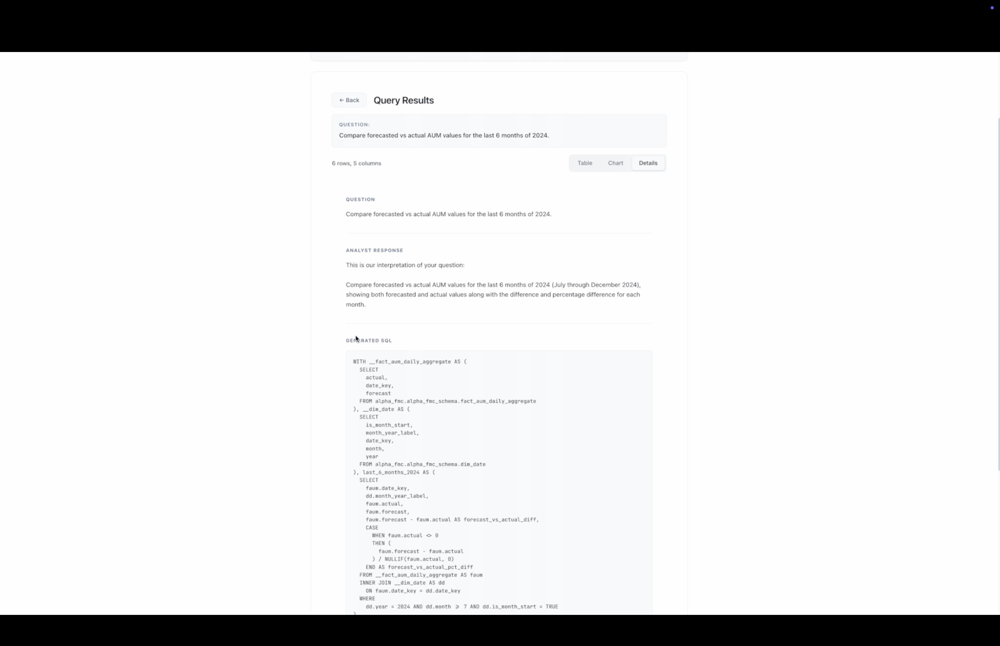

</td>
</tr>
</table>

### Dark Mode

<table>
<tr>
<td width="50%">

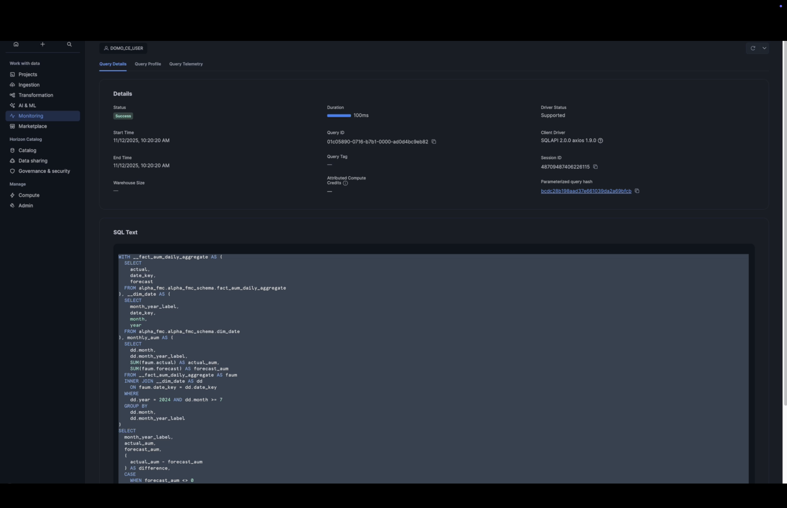

</td>
<td width="50%">

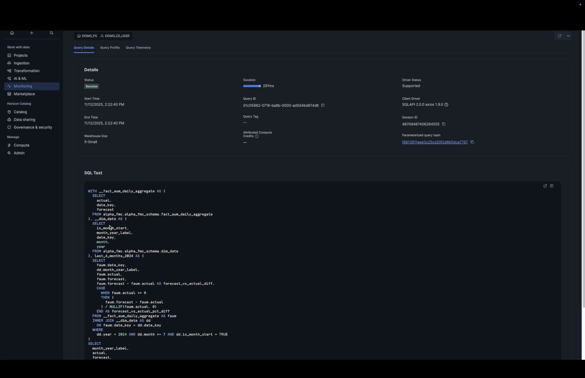

</td>
</tr>
<tr>
<td>

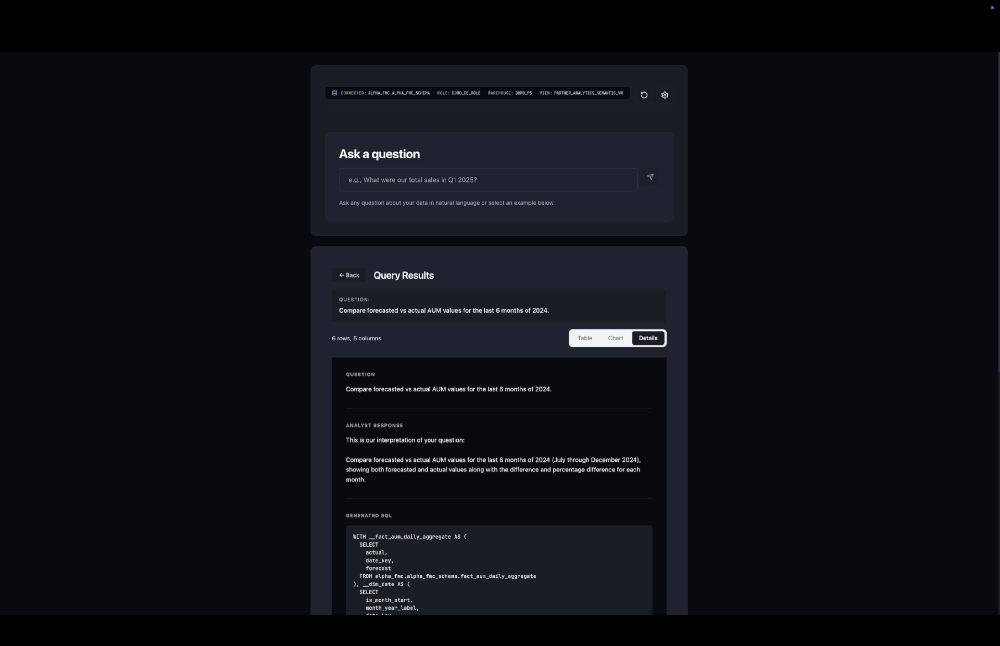

</td>
<td>

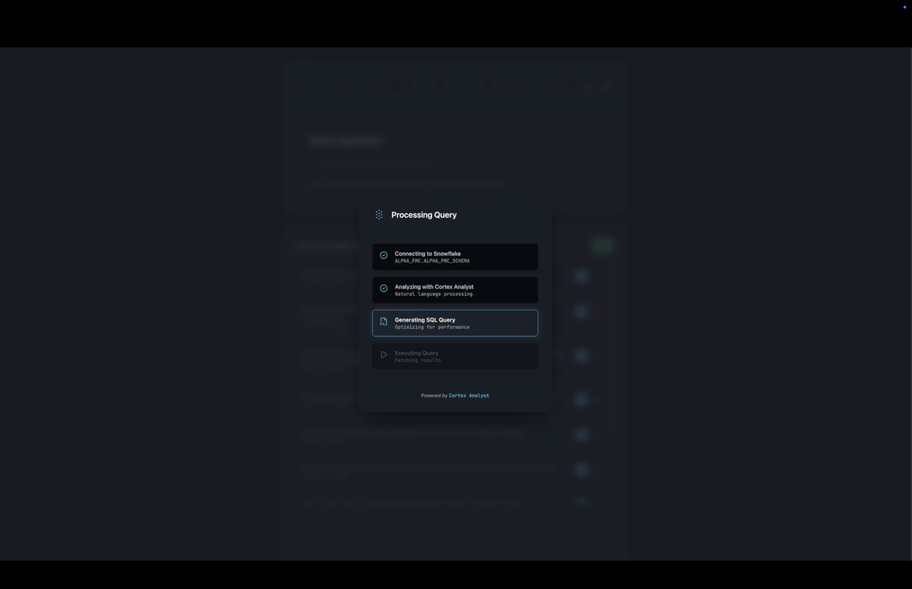

</td>
</tr>
<tr>
<td colspan="2">

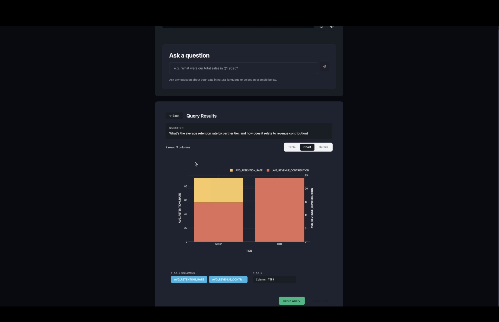

</td>
</tr>
</table>

---

## Data Persistence

Two Domo AppDB collections back the application:

### `configuration`

>  

| Column | Type | Purpose |
|---|---|---|
| `snowflake_database` | `STRING` | Target Snowflake database |
| `snowflake_schema` | `STRING` | Target schema within the database |
| `snowflake_role` | `STRING` | Snowflake role for query execution |
| `snowflake_warehouse` | `STRING` | Compute warehouse |
| `snowflake_view` | `STRING` | Cortex Analyst semantic view name |

### `recent_queries`

>  

| Column | Type | Purpose |
|---|---|---|
| `query_text` | `STRING` | Original natural language question |
| `sql_generated` | `STRING` | Physical SQL (for re-execution) |
| `logical_sql` | `STRING` | Logical SQL (for display) |
| `result_columns` | `STRING` | JSON-stringified column names |
| `result_row_count` | `LONG` | Number of rows returned |
| `created_at` | `STRING` | ISO 8601 timestamp |
| `analyst_message` | `STRING` | Cortex Analyst interpretation text |

---

## Getting Started

### Prerequisites

| Requirement | Details |
|---|---|
|  | Runtime environment |
|  | Package manager (npm/yarn also supported) |
|  | [`@domoinc/da`](https://www.npmjs.com/package/@domoinc/da) + [`ryuu`](https://www.npmjs.com/package/ryuu) |
|  | Snowflake account with Cortex Analyst enabled + Semantic View |
|  | Snowflake OAuth client ID, secret, and refresh token stored in Domo Accounts |

### Installation

```bash
git clone https://github.com/cassidythilton/cortex-chat.git
cd cortex-chat
pnpm install
```

### Configuration

#### Step 1 — Snowflake OAuth Account (Domo)

Create an OAuth account in your Domo instance:

| Account Field | Maps To |
|---|---|
| `username` | Snowflake OAuth **Client ID** |
| `password` | Snowflake OAuth **Client Secret** |
| `domoAccessToken` | Snowflake OAuth **Refresh Token** |

Then update `ACCOUNT_ID` in `codeengine.js` with your Domo account ID.

#### Step 2 — Snowflake Account Identifier

Update `ACCOUNT` in `codeengine.js` with your Snowflake account (e.g., `ab12345.us-east-2`).

#### Step 3 — Code Engine Deployment

Deploy `codeengine.js` as a Domo Code Engine package exposing:

| Function | Purpose |
|---|---|
| `callAnalyst` | NL → SQL → Execute → Results pipeline |
| `executeStoredSql` | Re-execute stored SQL without Cortex Analyst |

#### Step 4 — Manifest Overrides

After first upload, copy the generated `id` and `proxyId` into `src/manifestOverrides.json`:

```json
{
  "your-instance": {
    "description": "Your Domo instance",
    "manifest": {
      "id": "YOUR_ASSET_ID",
      "proxyId": "YOUR_PROXY_ID"
    }
  }
}
```

#### Step 5 — Login & Run

```bash
domo login
pnpm start
```

---

## Available Scripts

| Script | Description | When to Use |
|---|---|---|
| `pnpm start` | Start Vite dev server with Domo proxy | Local development |
| `pnpm build` | Lint + format + test + production build | Pre-deploy validation |
| `pnpm test` | Vitest in watch mode | Development |
| `pnpm test:ci` | Tests (single run, no color) | CI pipelines |
| `pnpm lint` | ESLint with auto-fix | Code quality |
| `pnpm format` | Prettier formatting | Code style |
| `pnpm upload` | Build + upload to Domo | Deployment |
| `pnpm storybook` | Storybook dev server (port 6006) | Component development |
| `pnpm generate` | Scaffold component or reducer | New feature scaffolding |

---

## Project Structure

```
cortex-chat/
├── codeengine.js                 # Backend — OAuth, Cortex Analyst, SQL execution
├── public/
│   ├── manifest.json             # Domo app manifest (packages, collections, sizing)
│   └── static/                   # Screenshots and assets
├── src/
│   ├── main.tsx                  # Entry point — React 18 + Redux Provider
│   ├── components/
│   │   ├── App/                  # Root layout shell
│   │   ├── AppHeader/            # Branding bar (Domo + Snowflake logos, theme toggle)
│   │   ├── ChatApp/              # Main orchestrator — chat + results + config
│   │   ├── ChatContainer/        # Chat header + input wrapper
│   │   ├── ChatHeader/           # Config status, settings gear, clear conversation
│   │   ├── ChatInput/            # NL input field, send, response processing
│   │   ├── ChartView/            # Plotly.js — auto chart type, multi-axis, aggregation
│   │   ├── ConfigPanel/          # Snowflake config modal (5 fields)
│   │   ├── ConfigStatus/         # Connection indicator (database.schema • role • warehouse)
│   │   ├── ConfirmModal/         # Reusable confirmation dialog
│   │   ├── ExampleQuestions/     # Verified query suggestion cards
│   │   ├── Message/              # Chat bubble (supports HTML + plain text)
│   │   ├── ProcessAnimation/     # 4-step processing overlay with progress bars
│   │   ├── QueryDetailsModal/    # Query detail popup (from recent queries)
│   │   ├── QueryDetailsView/     # Inline detail view (question, SQL, summary)
│   │   ├── QueryResultsPanel/    # Tabbed panel: Table | Chart | Details
│   │   ├── RecentQueries/        # Query history sidebar with rerun/delete
│   │   ├── TableModal/           # Full-screen AG Grid modal
│   │   └── TypingIndicator/      # Animated step-through typing indicator
│   ├── reducers/
│   │   ├── chat/slice.ts         # Redux Toolkit slice — state + 7 async thunks
│   │   ├── createAppSlice.ts     # Typed slice factory
│   │   └── index.ts              # Store configuration
│   ├── services/
│   │   ├── configService.ts      # Domo Datastore CRUD — configuration collection
│   │   ├── domoService.ts        # Cortex Analyst + SQL execution client
│   │   └── recentQueriesService.ts  # AppDB CRUD — recent_queries collection
│   ├── utils/
│   │   ├── appDbHelpers.ts       # AppDB response unwrapping utility
│   │   └── mockData.ts           # Synthetic mock data for offline development
│   ├── styles/
│   │   ├── theme.scss            # CSS custom properties (light + dark tokens)
│   │   └── ag-grid-theme.scss    # AG Grid theme overrides
│   └── types/
│       └── domo.d.ts             # Domo SDK type declarations
├── setupProxy.js                 # Ryuu proxy config for local dev
├── vite.config.ts                # Vite — plugins, proxy, build, env
├── tsconfig.json                 # TypeScript config
├── eslint.config.js              # ESLint 9 flat config
├── package.json                  # Dependencies + scripts
└── pnpm-lock.yaml                # Lockfile
```

---

## Tech Stack

| Category | Technology | Version | Badge |
|---|---|---|---|
| Framework | React | 18.3 |  |
| Language | TypeScript | 5.6 |  |
| Build | Vite | 5.4 |  |
| State | Redux Toolkit | 2.2 |  |
| Data Grid | AG Grid Community | 34.3 |  |
| Charts | Plotly.js | 3.2 |  |
| Icons | Lucide React | 0.553 |  |
| Styling | SCSS Modules | — |  |
| Testing | Vitest + Testing Library | 2.1 |  |
| Linting | ESLint + Prettier | 9 / 3 |  |
| Platform | Domo Custom Apps | — |  |
| Backend | Domo Code Engine | Node.js |  |
| Persistence | Domo AppDB | Datastores |  |
| AI/ML | Snowflake Cortex Analyst | — |  |

---

## License

This project is provided as-is for demonstration and reference purposes.


